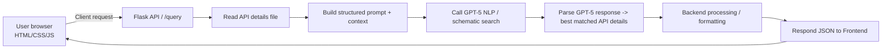

# Project: Frontend (HTML/CSS/JS) ↔ Flask Backend ↔ GPT-5

> This README shows screenshots (home, recommendations, no-response), an architecture diagram, file structure.

---

## Table of contents

* [Screenshots / Images](#screenshots--images)
* [Architecture Diagram](#architecture-diagram)
* [How it works](#how-it-works)
* [File layout](#file-layout)

---

## Screenshots / Images


*Figure: Home page (docs/home.png)*


*Figure: Recommendations page (docs/recommendations.png)*


*Figure: No response found (docs/no_results.png)*

---

## Architecture diagram



*Figure: Mermaid architecture — frontend → Flask → file-based API details → GPT-5 → backend processing → frontend.*

---

## How it works

1. Frontend sends a client request (user query + minimal context) to Flask endpoint `/enrich`.
2. Flask reads `payload.json` that contains API metadata (paths, params, purpose, etc).
3. Flask builds a structured prompt that contains the API catalog plus the user request and any shared context.
4. Flask calls the LLM (GPT-5) to perform a schematic / semantic search that returns the best-matching API endpoints and required parameters.
5. Flask interprets the LLM output, optionally validates or enriches it, and responds back to the frontend.

---

## File layout

```
API Catalog/
├─ frontend/
│  ├─ index.html
│  ├─ styles.css
│  └─ script.js
├─ backend/
│  ├─ app_openai.py          # Flask app
│  ├─ payload.json
├─ docs/
│  ├─ home.png
│  ├─ recommendations.png
│  └─ no_results.png
└─ README.md
```
---
